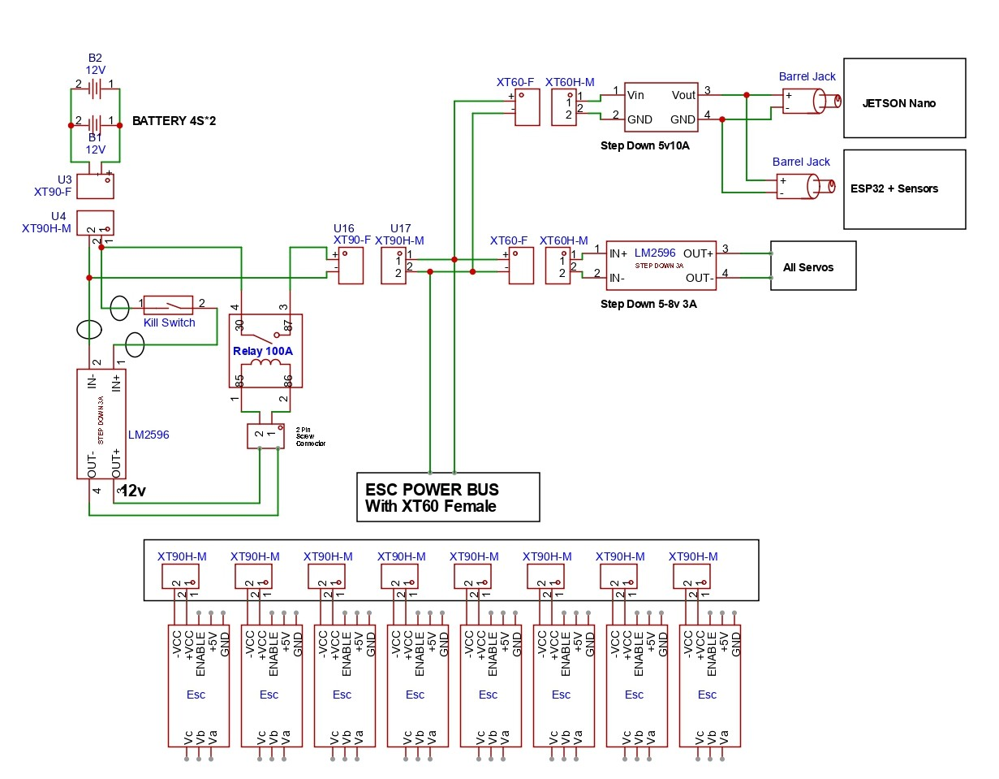
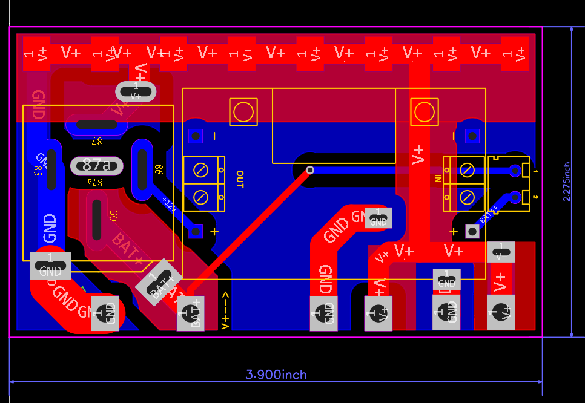
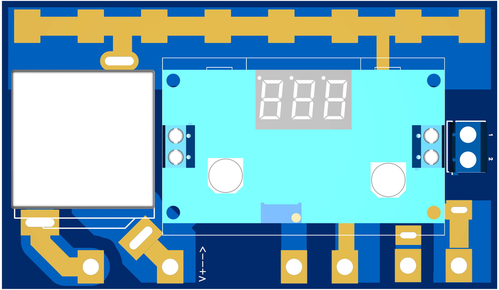
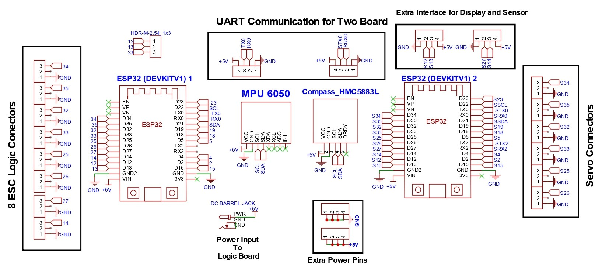
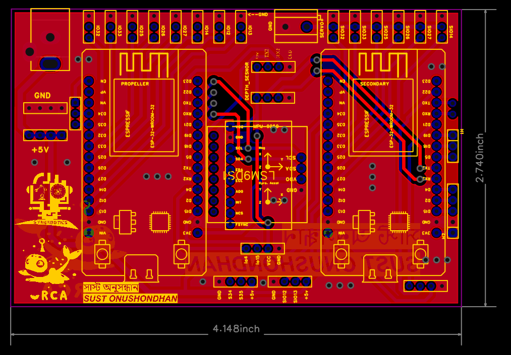
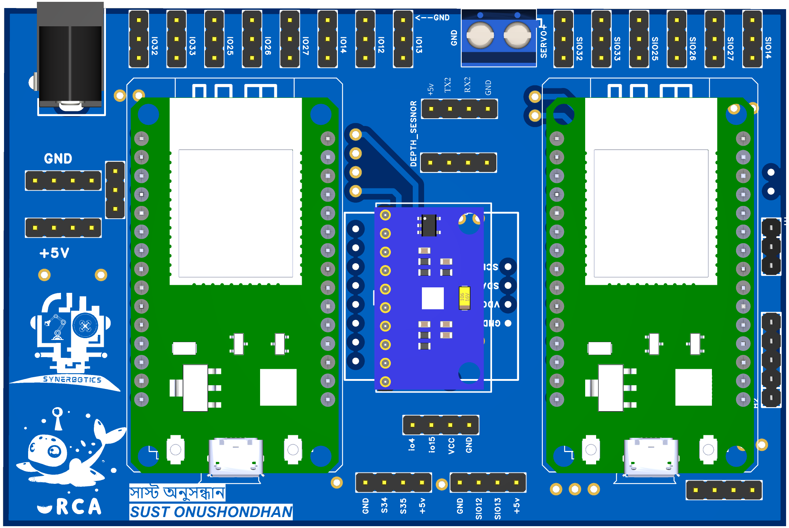

# 🐋 ORCA Electrical System

This repository documents the electrical design and integration of the ORCA project. It includes the schematic, PCB layout, and power management structure. The electrical system is designed for high-reliability underwater operation, with emphasis on modular power regulation, logic control, and embedded communication.

---

## 📐 System Overview

- **Batteries**: Two 4S Li-ion packs (16.8V, 5000mAh) connected in **parallel** for higher current capacity.
- **ESC Powering**: Battery output directly feeds the propeller ESCs via a **100A relay**, which is controlled via a **Kill Switch**.
- **Voltage Regulation**: Three independent buck converters step down the voltage for:
  - Relay control (12V)
  - Logic (5V @ 3A)
  - Jetson Nano (5V @ 10A)
- **Logic**: Two ESP32 DevKitV1 modules handle ESC control and sensor/servo interfacing.
- **Communication**: ESP32s communicate with the **Jetson Nano** using **UART Serial** in parallel.

---

## 🔋 Power Architecture

### 🔌 Buck Converters Used

| Output Voltage | Load           | Module Used     | Input Voltage | Notes                        |
|----------------|----------------|------------------|----------------|-------------------------------|
| 12V            | Relay coil     | LM2596 Buck       | 16.8V          | Controlled via kill switch   |
| 5V @ 3A        | ESP32s + Logic | 5V 3A Buck Module | 16.8V          | Logic power rail             |
| 5V @ 10A       | Jetson Nano    | 10A Buck Module   | 16.8V          | High power for computing     |

---

## 📊 Schematic Diagram

  
*Figure: Full system schematic including power rails, relay control*

---

## 🧩 Power Distribution PCB

- Integrates:
  - 100A relay
  - Buck converter for Relay Switching (12V)
  - ESC solder pads
- Wide **copper pours** are used for high current handling.
- Optimized for compact waterproof enclosure integration.

  
*Figure: Top layer of custom power PCB*

  
*Figure: 3D view of assembled PCB*

---

## 🧠 Logic Control

### 🛠️ Microcontroller Setup

- **ESP32 DevKit V1 #1**  
  Controls 8 ESCs via PWM using **Servo Library**.
  - Recommended PWM pins used:  
    `2, 4, 12–19, 21–23, 25–27, 32, 33`

- **ESP32 DevKit V1 #2**  
  Handles:
  - Underwater Acoustic Distance Sensor
  - Pressure Sensor
  - Servos for robotic arm

  
*Figure: Logic Circuit board including 2 ESP32, IMU, and other peripheral connectors*

### 🔄 ESP32 ↔ Jetson Nano

- Serial communication (UART) used for bidirectional data exchange.
- Allows real-time control and sensor data flow.

---

## 🧱 Design Highlights

- **Relay Isolation**: Propeller power line isolated via 100A relay, controlled using a 12V kill switch line.
- **High Current PCB Design**: Custom copper pour and trace widths optimized for >40A combined draw.
- **Compact Integration**: All major electrical components are embedded on a single PCB to minimize wiring.
- **Modular Power System**: Three distinct voltage levels supplied via independent buck modules.

---

  
*Figure: Top layer of custom logic PCB*

  
*Figure: 3D view of assembled Logic PCB*

| #  | Component                         | Description                              | Quantity | Purchase Link                                                                                                                         |
| -- | --------------------------------- | ---------------------------------------- | -------- | ------------------------------------------------------------------------------------------------------------------------------------- |
| 1  | 4S Li-ion Battery (16.8V 5000mAh) | Power source for propulsion & control    | 2        | [MMRC BD](https://www.mmrcbd.com/bt-14-8v-5200mah-65c-4s-lipo-battery)   |
| 2  | 100A Automotive Relay             | Power switching relay for ESCs           | 1        | [ElectronicsBD](https://www.electronics.com.bd/components-price-in-Bangladesh/12vdc-100a-heavy-duty-double-contacts-5-contacts-silver-contacts-automatic-relay) |
| 3  | LM2596 Buck Converter (12V)       | Steps down 16.8V to 12V and 5V           | 1        | [RoboticsBD](https://store.roboticsbd.com/components/1524-lm2596-dc-dc-step-down-buck-converter-with-digital-tube-display-robotics-bangladesh.html)                                                                                                                                                                      |
| 4  | 10A Buck Converter             | High-current power for Jetson Nano       | 1        | [RoboticsBD](https://store.roboticsbd.com/power-module-adapter/1764-voltage-regulator-buck-converter-max-5-40v-to-12-36v-step-down-robotics-bangladesh.html)                                                                                        |
| 5  | ESP32 DevKit V1                   | Microcontroller for ESC + sensor control | 2        | [RoboticsBD](https://store.roboticsbd.com/development-boards/2266-esp32-dev-board-ch340-usb-c-robotics-bangladesh.html)                                                                                        |
| 6  | Jetson Nano (4GB)                 | Main onboard AI computing unit           | 1        | [NVIDIA Store](https://developer.nvidia.com/embedded/jetson-nano-developer-kit)                                                                                     |
| 7  | Underwater Acoustic Sensor        | For obstacle detection (e.g., DYP-A02)   | 1        | [RoboticsBD](https://store.roboticsbd.com/underwater-robotics/3096-ip68-underwater-ultrasonic-obstacle-avoidance-sensor-3m-uart-robotics-bangladesh.html)                                            |                           |
| 8 | XT60 Connectors                   | Battery input/output terminals           | 4–6      | [Anyshop]                                                                              |

